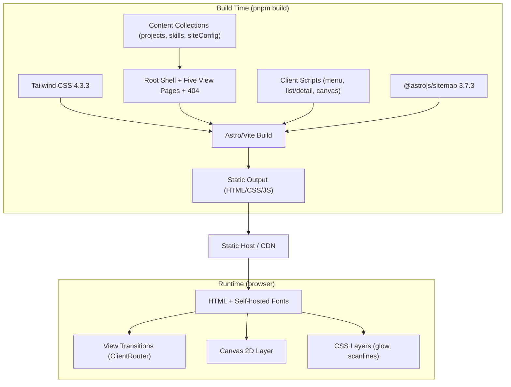
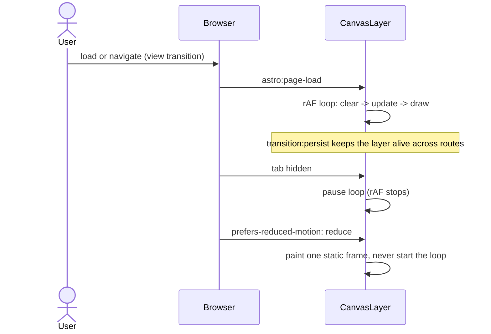
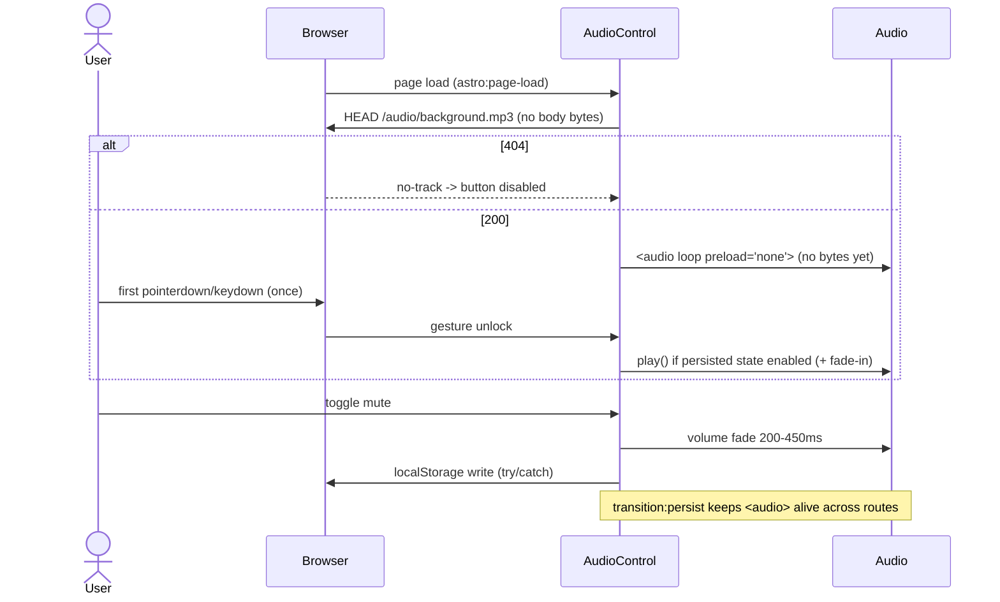

# ARCHITECTURE.md

> **Status**: Approved | **Last updated**: 2026-08-11 | **Author**: Jonathan Soto (jonasotoaguilar)

## System Overview **[ALWAYS]**

A fully static personal portfolio for Jonathan Soto, Backend & Full-Stack Engineer, built as a Persona-3 game-menu shell. The root route `/` is a full-screen menu of five items (ABOUT, RESUME, PROJECTS, SKILLS, CONTACT) — centered/center-right, diagonally staggered, with a persistent colorful keyboard-active indicator — and selecting one changes the complete view to its own static route (`/about`, `/resume`, `/projects`, `/skills`, `/contact`), with the 404 page preserved for unknown paths. Astro 7.2.0 generates plain HTML at build time from Markdown Content Collections; a fixed layered background (CSS radial glow, CSS CRT scanlines, Canvas 2D particles, and an original decorative figure/artifact SVG layer) plus native View Transitions provide the Persona-3 feel. A fixed bottom-right control cluster holds keyboard hints and the ambient-audio mute toggle; optional audio plays only a user-provided licensed track (`/audio/background.mp3`) after the first gesture. There is no backend, database, or cache: the product has zero server-side state (audio preference persists client-side in `localStorage`) and no build-time network dependency. This document describes the approved target; the landing implementation currently in `src/` (single scrolling page, `CompactNav`, `MenuOverlay`, `sections/*`) is the model being replaced — see [Migration Notes](#migration-notes).

---

## Architecture Pattern **[ALWAYS]**

**Chosen pattern**: Static Site Generation (SSG) with progressive enhancement

**Why this pattern**: The portfolio is a brochure site with four projects, authored entirely in Markdown, presented as five small static views. SSG gives the fastest possible first paint, per-view crawlability for recruiters arriving from search or LinkedIn, zero runtime infrastructure, and a fully deterministic build. All interactivity (menu motion, list/detail selection, canvas background, view transitions, the no-scroll viewport) is progressive enhancement on top of plain HTML: without JavaScript every route renders all content in normal document flow.

**Alternatives evaluated**:
- **React SPA (reference repo approach)**: Vite + React 19 + react-router 7 delivers the aesthetic but ships a client-rendered shell and a custom router where Astro's static output plus native View Transitions suffice. See ADR-0001.
- **Client-only view state (single `/` route)**: one route with JS-switched views destroys per-view URLs and SEO, contradicts the preserved crawlability contract, and ships view-state routing logic for zero benefit. See ADR-0003.
- **Detail sub-routes (`/projects/:slug`)**: 9+ pages where the approved interaction is an in-view panel; deferred to v2.0. See ADR-0003.
- **SSR / on-demand rendering (Node server)**: Adds a runtime, deployment surface, and cost with zero product benefit for file-based content. Rejected for the same reason there is no backend: the site holds no user data, no forms, no auth, and no dynamic content — a backend would add latency, cost, and attack surface without enabling any feature. Databases and caches are excluded by the same argument; there is nothing to store or retrieve at runtime.

---

## Architecture Views & Diagrams **[ALWAYS]**

### System Architecture Diagram



### Runtime Flow: menu navigation and list/detail

```mermaid
sequenceDiagram
    actor User
    participant Browser
    participant Shell
    participant View
    User->>Shell: ArrowUp/ArrowDown + Enter (root /)
    Shell->>Browser: navigate to a real route (e.g. /projects)
    Browser->>View: ClientRouter swap with overlay <= 400ms
    User->>View: Enter / ArrowRight on a LIST item
    View->>View: open in-view detail panel (per-view state, #slug)
    User->>View: Escape
    Note over View: panel open -> close panel; no panel -> navigate to /
    View->>Browser: navigate directly to the / route (route swap)
    Browser->>Shell: route change to / (no client router state)
    User->>Browser: Back button
    Browser->>View: previous history entry via native history (no custom code)
```

### Runtime Flow: canvas background lifecycle



### Runtime Flow: ambient audio lifecycle



---

## Route Inventory

| Route | Page | Role |
|-------|------|------|
| `/` | `index.astro` | Game-menu shell: five giant skewed route links, keyboard-first |
| `/about` | `about.astro` | Identity, role, focus areas from `site.config.yaml` |
| `/resume` | `resume.astro` | CV-backed LIST (EDUCATION, EXPERIENCE, PROJECTS) + detail panel |
| `/projects` | `projects.astro` | LIST of the four verified projects + detail panel; `#slug` deep links |
| `/skills` | `skills.astro` | Grouped skills LIST + detail panel (no ranks or metrics) |
| `/contact` | `contact.astro` | Email CTA, GitHub, WealthQuest links |
| `/404` | `404.astro` | Unknown paths; visual identity preserved; excluded from sitemap |

---

## Component Details **[ALWAYS]**

### Build pipeline (Astro 7.2.0 + Vite)

- **Technology**: Astro 7.2.0 (SSG), TypeScript 6.0.3 (strict; TS 7.x breaks `astro check`'s language server, so the 6.x line is pinned), `@astrojs/sitemap` 3.7.3, pnpm, Node >= 24.
- **Responsibility**: Compiles Content Collections, the shell, five view pages, styles, and client scripts into a deterministic static output. No scaling applies — output is static files served by any static host/CDN.
- **Dependencies**: Content Collections (Markdown/YAML), Tailwind via `@tailwindcss/vite`, fontsource packages.
- **Failure modes**: A content schema violation or TypeScript error fails the build; CI catches it before deploy.

### Content Collections (Markdown + YAML)

- **Technology**: Astro Content Collections: `projects` (glob of 4 `.md`), `skills` and `siteConfig` (`file()` loaders over YAML), schema-validated at build time.
- **Responsibility**: Single source of truth for the four projects, grouped skills, and site config (name, role, tagline, focus areas, email, socials). The PROJECTS view renders exactly the four verified entries (`assertExactlyFour`, `sortByOrder`); SKILLS renders plain names only — the schema rejects non-string levels. Bounded, file-based content; no runtime dependencies; missing or mistyped front matter fails the build with a schema error.
- **Resume content source**: the RESUME view renders only verified CV data (August 2026 CV): USACH Ingeniería de Ejecución en Computación e Informática (Mar 2020–Apr 2025) and technical telecommunications education (Mar 2017–Nov 2019); experience at Productos Barber Chile (2020–2026) and the Policomp IT support internship (Jan–Mar 2020); the ServiceFlow and WealthQuest projects; the WealthQuest academic publication (May 2025); languages Spanish (native) and English (basic technical reading). No ranks, metrics, or phone number are published. A typed resume content model/file will be added during apply so this data is schema-validated like the other collections.

### Game-menu shell (root `/`)

- **Technology**: `index.astro` + the shell keyboard model (existing `reduceMenuKey` reused: ArrowUp/ArrowDown wrap, Enter activates) and `motion` 13.0.0 vanilla entrances.
- **Responsibility**: Render the full-screen game shell: five giant skewed `menu-label` links, centered/center-right with per-item diagonal offsets/skews/sizes (inline CSS vars consumed by one `.menu-item` rule), staggered entrance, and a persistent keyboard-active indicator. `shell.ts` sets `data-active` + `aria-current="page"` on the active item (initial, on ArrowUp/Down, cleared on teardown); CSS renders the shared active treatment for `data-active` and `:hover` while `:focus-visible` keeps its outline. Activating an item navigates to its real route. Fixed at exactly five items; without JS the menu is a plain vertical list of real links and every view stays reachable.

### Decorative figure layer

- **Technology**: `FigureLayer.astro` — one hand-authored inline-SVG composition per route, positioned by `html[data-route]`-scoped CSS in `global.css`; zero JavaScript, zero asset weight (ADR-0002-compliant).
- **Responsibility**: Original abstract figure/artifacts (faceted featureless bust in deep-blue fills with cyan rims, plus angular bars/chevrons/chips/slashes) between the canvas and content on every route. Route variants: shell → oversized figure on the right half; projects → cyan top band; skills → right figure framing center; about → bottom-left figure; contact → bottom blue wash + left figure; resume → left-mid figure; 404 → shell variant. Decorative only: `aria-hidden`, `pointer-events-none`; static under reduced motion (no entrance fade).
- **Failure modes**: none — static SVG/CSS renders without JS and without the canvas.

### Control cluster & ambient audio

- **Technology**: `ControlCluster.astro` (KeyHints content + `AudioControl` markup) rendered in `BaseLayout` with `transition:persist`; `src/lib/audio/state.ts` pure reducer (`no-track → ready ⇄ playing ⇄ muted`) + `src/scripts/ambient-audio.ts` DOM wiring (lifecycle mirrors `living-background.ts`: rebind on `astro:page-load`, teardown on `astro:before-swap`). The HEAD probe runs exactly once per module init / persisted-island lifecycle: module-level in-flight guard keeps it idempotent, the result is stashed on the persisted cluster element, and route swaps adopt it without re-probing; in-flight probes abort on teardown.
- **Responsibility**: Fixed bottom-right cluster (bottom 1.5rem / right 1.75rem) with decorative key hints and the ambient-audio mute button (`aria-pressed`, visible label). Track presence detected via a HEAD request (zero body bytes); `<audio loop preload="none">` loads bytes only on play; playback starts silent and unlocks once on first `pointerdown`/`keydown`; no autostart under reduced motion. Muted state persists to `localStorage["portfolio:audio:muted"]` (try/catch; storage failure → in-memory). `public/audio/README.txt` documents the BYO licensed-track contract; no bundled audio ships (ADR-0004).
- **Failure modes**: missing track → disabled no-track state, site stays silent; autoplay blocked → silent until first gesture; storage unavailable/throwing → in-memory toggle, never throws; HEAD unsupported (405/network error) → optimistic ready, and a later `<audio>` error dispatches the reducer `audio-error` event → disabled no-track state.

### View pages (five static routes)

- **Technology**: One `.astro` page per route (`about`, `resume`, `projects`, `skills`, `contact`), each with its own `<title>`, exactly one `<h1>` inside a single `<main>` landmark, and per-view JSON-LD.
- **Responsibility**: Full-viewport game screens (`100dvh`, `overflow: hidden` applied by the enhancement layer) with a view header, back-to-menu control, LIST column, and detail panel where applicable. Static pages, no view-state routing logic; a view without JS scrolls normally and renders all content in document flow — nothing hides behind a script.

### LIST/detail panels (state boundaries)

- **Technology**: Per-view vanilla script + `motion` 13.0.0; selection state is **client-side and per-view** — never persisted across routes.
- **Responsibility**: PROJECTS, RESUME, and SKILLS render a LIST column of `list-item` surfaces; the selected item opens a `detail-panel` with badges, description, stack, and external links.
- **State boundaries**: selection lives only inside the view's script; the URL carries at most a fragment (`/projects#serviceflow`), which preselects on load. Opening a panel moves focus into it; closing returns focus to the list item. On mobile the panel stacks below the list and gains its own internal scroll region (fixed list sizes: 4 projects, grouped skills, resume sections).
- **Failure modes**: Without JS all detail content is rendered in document flow; deep-link fragments scroll to the entry.

### Keyboard model

- **Technology**: Vanilla TypeScript; handlers scoped to the active screen — never global `window` keydown listeners (the reference's verified defect).
- **Responsibility**: Shell: ArrowUp/ArrowDown/Enter. Views: ArrowUp/Down move the LIST, Enter/ArrowRight open detail, Escape closes one level (panel) and then returns to `/`; Browser Back follows native history. One scoped handler per active screen; the existing "no hijack when closed" test pattern extends to views; unsupported keys no-op.

### Client interaction layer

- **Technology**: `motion` 13.0.0 (vanilla API in scripts), Astro native View Transitions (`<ClientRouter/>` with `fallback="none"`), Canvas 2D TypeScript.
- **Responsibility**: Menu/card motion, cross-page view transitions with per-view overlay moments (<= 400ms total; 300ms default, 400ms documented exception; opacity-only <= 200ms under reduced motion), and the living canvas background (clear -> update -> draw). The figure layer is static SVG/CSS (one gated entrance fade only); the control cluster persists across swaps via `transition:persist` so audio playback never restarts. Fixed cost: the canvas caps particle count and devicePixelRatio and pauses when the tab is hidden.
- **Dependencies**: None beyond the browser.
- **Failure modes**: View Transitions unsupported — full-page navigation fallback; canvas unsupported or JS disabled — content still renders and CSS glow/scanlines/figure layer remain; reduced motion — canvas paints a static frame and audio never autostarts.

### SEO layer

- **Technology**: `src/lib/seo/person.ts` (JSON-LD `Person` with `sameAs`), `src/lib/seo/sitemap.ts` (`isSitemapEligible`), `@astrojs/sitemap` 3.7.3.
- **Responsibility**: Per-view titles (e.g. "Projects · Jonathan Soto"), exactly one `h1` per page, one `<main>` landmark per view, JSON-LD on the shell and views, and a build-time `sitemap.xml` listing the index plus the five view routes (404 excluded). Static; a missing title/h1 fails E2E checks and the sitemap filter keeps 404 out by construction.

### Quality toolchain

- **Technology**: Vitest 4.1.10 (+ `@vitest/coverage-v8`), Playwright 1.62.1, Biome 2.5.7, Lefthook 2.1.10, Stryker 9.6.1 (vitest-runner, mutation readiness).
- **Responsibility**: Unit tests, E2E tests, lint/format, git hooks, and mutation-readiness validation. CI fails on any gate; nothing ships without lint, tests, and build passing.

---

## Non-Functional Requirements **[CONDITIONAL — applicable categories with measurable targets]**

### Performance

- LCP: < 2.5s on a mid-range device over 4G; INP: < 200ms; CLS: < 0.1.
- JavaScript budget: < 100KB gzipped on first load (canvas layer and motion scripts included; no framework runtime by default).
- Per-view transition overlays: <= 400ms total (300ms default; 400ms documented exception); opacity-only <= 200ms under reduced motion.
- Fonts: self-hosted via `@fontsource` (Anton, Bebas Neue); no external font CDN.
- Build time: full static build completes in < 3 minutes on CI.

### Accessibility

- Exactly one `h1` and a single `<main>` per view; `text-primary` on `bg-base` exceeds AA; accent on dark surfaces keeps 4.5:1 minimum for text.
- Menu and list/detail fully operable by keyboard; handlers scoped to the active screen (never global); `:focus-visible` accent outlines remain visible alongside the active indicator (never suppressed); the shell active item exposes `data-active` + `aria-current="page"`; the mute toggle is keyboard-operable with `aria-pressed` and a visible label; touch targets >= 44px.
- Background and figure layers are `aria-hidden` and `pointer-events-none`; decorative watermarks and key hints hidden from assistive tech.
- `prefers-reduced-motion: reduce`: canvas paints one static frame, glow holds, entrances and view transitions become opacity-only, the figure layer renders static, and ambient audio never starts automatically.

### Security

- No server, no user input, no cookies, no secrets, no third-party scripts.
- The ambient-audio mute preference persists in `localStorage` only (client-side; fails safely to an in-memory state when storage is unavailable or throws). No bundled copyrighted audio or art ships — figures are original vectors and audio is BYO licensed (ADR-0004).
- External links open with `rel="noopener noreferrer"`; the CV phone number is never published.

### Maintainability

- All content is file-based Markdown/YAML with typed schemas; no content CMS.
- CI pipeline stages: `pnpm lint` (Biome), `pnpm typecheck`, `pnpm test` (Vitest + coverage), mutation-readiness check (Stryker dry-run), `pnpm test:e2e` (Playwright), `pnpm build`.
- Git hooks via Lefthook enforce lint/format and test gates before push.

### Availability

- Static output on a standard static host; availability is bound by the hosting provider's SLA (no application layer to fail).

---

## Testing Strategy

| Layer | Tool | Version | Scope |
|-------|------|---------|-------|
| Unit | Vitest (`getViteConfig` from `astro/config`) | 4.1.10 | Content schemas, shell menu keys, list/detail selection state, canvas/motion pure logic, SEO helpers. `@astrojs/vitest` is deleted from npm; plain Vitest with Astro's Vite config is the supported path |
| Coverage | `@vitest/coverage-v8` | 4.1.10 | Coverage report on unit tests |
| E2E | `@playwright/test` | 1.62.1 | Shell menu navigation (active indicator `aria-current`/`data-active`, stagger non-overlap, coarse-pointer collapse), five view routes, LIST/detail + `#slug` deep links, Escape/Back return, no-keyboard-hijack, control cluster placement, ambient audio (no-track state, gesture gate, mute persistence, navigation survival), mobile stacked detail, 404 page, reduced-motion static canvas + static figures, link checks, sitemap presence |
| Mutation readiness | `@stryker-mutator/core` + vitest-runner | 9.6.1 | `dryRunOnly` validation gates the toolchain; full campaigns are a later hardening step |
| Lint / format | `@biomejs/biome` | 2.5.7 | Style and correctness gates, enforced in CI and via Lefthook |

---

## Key Decisions **[ALWAYS]**

| Decision | Rationale | Alternatives Considered |
|----------|-----------|------------------------|
| Astro 7.2.0 SSG over React SPA | Static output, best first paint and crawlability, zero runtime infrastructure for a brochure site | React SPA (reference repo), SSR Node server — see ADR-0001 |
| Real static view routes + in-view detail over client-only state | Each view keeps its own URL, title, h1, JSON-LD, and sitemap entry; native Back; zero-JS reachability | Client-only view state (single `/` + JS switch) — see ADR-0003 |
| In-view LIST/detail panels with `#slug` deep links over detail sub-routes | Matches the game-panel interaction; per-project pages stay a v2.0 option | `/projects/:slug` and `/resume/:section` sub-routes — see ADR-0003 |
| Game-menu shell at `/` with five real route links | The approved product model: selecting an item changes the complete view, never a scroll | Scrolling single-page landing (current `src/` model, being replaced) |
| No backend, database, or cache | No server-side state exists; static files are the simplest correct architecture | Supabase/other BaaS — rejected, adds cost and surface for no feature |
| Markdown Content Collections | Schema-validated, versioned, editor-friendly content pipeline | JSON data files, headless CMS — rejected |
| Astro native View Transitions (`<ClientRouter/>`, `fallback="none"`) | Browser-driven cross-page motion with a full-page fallback and per-view overlays <= 400ms; no SPA router | react-router + AnimatePresence (reference repo) — removed |
| `motion` 13.0.0 vanilla API | Menu/card/list-detail motion in scripts with no React runtime; React islands reserved for the game menu only | framer-motion 12 React API (reference repo) |
| Canvas 2D particles/fog as the living layer | TypeScript-only, zero dependencies, persists across view transitions | Video assets (Remotion transparent WebM, MP4) — see ADR-0002 |
| Scoped keyboard handlers, never global | The reference's global key interception is a verified bug; unsupported keys no-op | Global window keydown listeners — rejected |
| CSS layers for glow and scanlines | Zero-JS ambient base; canvas is the only animated JS layer | JS-driven background — rejected |
| Original inline-SVG figure/artifact layer | Angular aesthetic with zero copyright risk, zero JS, zero asset weight; per-route compositions via `html[data-route]` CSS | Copied character art (reference repos) — rejected as infringement |
| BYO licensed ambient audio (HEAD probe, gesture unlock, localStorage mute) | License-safe optional audio; no bytes until play; silent default; persistent mute without a backend | Bundled Persona soundtrack — rejected (copyright); Web Audio synthesized pad — deferred to keep scope bounded; build-time file check — cannot see post-build BYO files. See ADR-0004 |
| Tailwind CSS 4.3.3 via `@tailwindcss/vite` | Single styling system, build-time purging, token-aligned with DESIGN.md | Hand-written CSS, CSS modules |
| Vitest via `getViteConfig` (no `@astrojs/vitest`) | `@astrojs/vitest` is deleted from npm; plain Vitest with Astro's Vite config is the supported integration | `@astrojs/vitest` — unavailable |
| Stryker 9.6.1 `dryRunOnly` for mutation readiness | Validates the mutation toolchain without gating on full campaigns | Full mutation campaigns in CI — deferred |
| pnpm + Node >= 24 | Fast, strict installs; engines pinned to LTS with host on Node 26.4 | npm, yarn |

---

## Failure Modes & Mitigations **[CONDITIONAL — realistic failure modes for this system]**

| Failure | Impact | Mitigation |
|---------|--------|------------|
| Keyboard hijack regression | Global listeners steal keys on inactive screens | Handlers scoped to the active screen; unsupported keys no-op; E2E "no hijack when closed" pattern extended to views |
| Active indicator missing after keyboard move | Keyboard-active item indistinguishable (documented-but-missing contract) | `shell.ts` sets `data-active` + `aria-current` on every move; E2E asserts both follow ArrowUp/Down |
| Menu items overlap after stagger | Unreadable/clickable-collision menu | Stacked column + fixed gap; per-item offsets alternate sign with >= 1rem separation; coarse-pointer viewports collapse offsets/skew (E2E bounding-box assertions) |
| Cluster overlaps content on small screens | Hints/controls cover menu or view content | Hints hide on coarse-pointer and short (<560px height) viewports; mute stays reachable >= 44px; E2E asserts non-overlap at desktop |
| Copyrighted audio/art ships | Infringement risk | No bundled media; original inline-SVG figures; BYO licensed track contract in `public/audio/README.txt` (ADR-0004); E2E asserts no audio file in `dist` |
| Autoplay policy blocks audio | Track never audible | Silent default; one-time `pointerdown`/`keydown` unlock; play() only after gesture; E2E asserts silence before first gesture |
| Missing track file | Dead control or console errors | HEAD probe (no body bytes) → disabled no-track state; `<audio>` error event resolves optimistic cases; site stays silent |
| localStorage unavailable or throwing | Audio preference lost or script crash | try/catch reads/writes; in-memory fallback; E2E asserts toggle still works |
| No-scroll viewport applied without JS | Content hidden from no-JS visitors and crawlers | `overflow: hidden` applied by the enhancement layer only; static HTML stays in normal document flow (E2E-verified) |
| View transition overlays exceed 400ms | Motion contract violation | Durations capped (300ms default, 400ms exception); reduced motion becomes opacity-only <= 200ms; E2E timing assertions |
| View Transitions unsupported (older browser) | No cross-page motion | `<ClientRouter/>` falls back to full-page navigation; E2E matrix covers Firefox and Safari |
| Mobile detail panel overflow | Detail unreachable on small screens (reference bug) | Panel stacks below the list and scrolls internally on < 768px |
| Reduced-motion user | Motion sickness / distraction | Canvas paints one static frame; entrances and overlays opacity-only; enforced by E2E with emulated `prefers-reduced-motion` |
| External link rot (itch.io, GitHub) | Dead project links | Link-check assertions in the E2E suite fail CI when a link stops resolving |
| Tab hidden while canvas animates | Battery drain on idle tabs | rAF loop pauses on `visibilitychange`; particle count and devicePixelRatio are capped |
| Canvas unsupported or JS disabled | Living layer absent | Glow and scanlines are pure CSS and still render; content is server-rendered HTML — progressive enhancement, no degradation of content |
| Static host outage | Site unreachable | Standard static-host SLA; redeploy path exercised on every release via CI build |

---

## Migration Notes

The `src/` tree still implements the single-page landing (index with Hero/Featured Work/Projects/Skills/Contact sections, `CompactNav`, `MenuOverlay`, anchor navigation, duplicated project grids). Until apply lands, this document describes the approved target, not the current code.

- **Replace**: `index.astro` landing composition -> game-menu shell; `CompactNav` + `MenuOverlay` + `menu.ts` -> shell menu + scoped view keyboard model (reusing `reduceMenuKey`); `sections/*` -> view pages with LIST/detail panels; anchor navigation -> real routes.
- **Delete**: the Featured Work grid (duplicated project rendering — one PROJECTS view only), the dialog overlay, and the `#featured-work`/`#projects`/`#skills`/`#contact` anchor contract.
- **Preserve**: content collections and schemas, fontsource fonts, DESIGN.md tokens and `global.css` layers (glow/scanlines, reduced motion), `Background.astro` + `particles.ts` + `transition:persist`, `JsonLd.astro` + `person.ts` + sitemap filtering, the 404 page, reduced-motion and link-check E2E patterns, the JS budget spec, and the toolchain/CI.
- **Post-apply follow-ups**: `README.md`, `docs/CODEBASE-GUIDE.md`, and `docs/codebase/mental-model.md` still describe the landing model and are deliberately not updated here; they must be refreshed after implementation reflects the shell + views.

---

## ADRs **[ALWAYS]**

- [ADR-0001: Astro 7 static architecture over React SPA](docs/adr/0001-astro-static-over-react-spa.md)
- [ADR-0002: Canvas 2D living background over video assets](docs/adr/0002-canvas-2d-background-over-video-assets.md)
- [ADR-0003: Real static view routes over client-view state](docs/adr/0003-static-view-routes-over-client-view-state.md)
- [ADR-0004: BYO licensed ambient audio over bundled soundtrack](docs/adr/0004-byo-licensed-ambient-audio.md)
