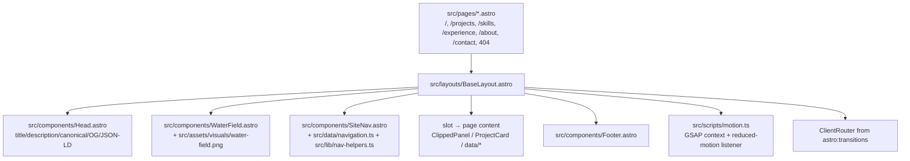

# Codebase Guide — Persona 3 Portfolio Rebuild

Concise mental model and contributor navigation for the static Astro portfolio. All paths, commands, and claims are verified against the current tree (`astro build` emits 7 static pages including 404, 24 unit tests, 40 E2E tests).

## What this codebase owns

Static, evidence-linked portfolio for Jonathan Soto. Six menu-scene routes share one visual grammar (clipped panels, water/bubble field, strong ink shadows) without copying Persona assets. No backend, no form, no runtime API — output is `dist/` served statically. Content is facts-only from public GitHub (`https://github.com/jonasotoaguilar`) and an owner-authorized private CV source that is summarized, not published.

What it does NOT own: user data storage, authentication, analytics dashboards, third-party form providers, or server rendering.

## Architecture at a glance

| Layer       | Choice                                                                                                             | Why it matters                                                                                                      |
| ----------- | ------------------------------------------------------------------------------------------------------------------ | ------------------------------------------------------------------------------------------------------------------- |
| Framework   | Astro `7.2.10` static output (`output: "static"` in `astro.config.mjs`)                                            | File-based routing, zero JS by default, view transitions via `astro:transitions`                                    |
| Styling     | Tailwind CSS `4.3.3` + `@tailwindcss/vite` with CSS-first `@theme` tokens in `src/styles/global.css`               | Design tokens are `--color-*`, `--clip-size`, `--shadow-*`, `--content-max` custom properties                       |
| Motion      | GSAP `3.15.0` + CSS drift (`global.css` + `src/scripts/motion.ts`) + Astro `ClientRouter`                          | Subtle entrance/parallax only; `prefers-reduced-motion` disables continuous motion                                  |
| Images      | `astro:assets` + `sharp` `0.33.5`                                                                                  | `src/assets/visuals/*.png` optimized to hashed `_astro/*.webp` with `srcset`/`sizes`                                |
| SEO         | Custom `Head.astro` + JSON-LD `Person` + conditional `@astrojs/sitemap` `3.7.4`                                    | Sitemap and canonical/OG only when `SITE` env is set; JSON-LD omits phone and unverified LinkedIn URL               |
| Lint/format | oxlint `1.81.0` / oxfmt `0.66.0`                                                                                   | Not Biome                                                                                                           |
| Packages    | pnpm `11.25.0` pinned via `packageManager`; `pnpm-workspace.yaml` `strictDepBuilds` allowlist (`esbuild`, `sharp`) | `cookie@2.0.1` pinned top-level to satisfy Astro prerenderer ESM import over a stray parent CommonJS `cookie@0.7.x` |
| Node        | `>=22.13.0` (`engines` in `package.json`)                                                                          | Required by Astro 7 / Vitest 4 / pnpm 11.25                                                                         |

## Route and layout flow

Every route is a standalone Astro page; there is no SPA shell.



Key details:

- `BaseLayout.astro` is the single layout: imports `global.css`, renders `<Head>` + `<ClientRouter>` in `<head>`, injects early `document.documentElement.classList.add("js")`, then `SkipLink`, `WaterField`, decorative `.bg-word` spans, `SiteNav` (driven by `Astro.url.pathname`), `<main id="main" tabindex="-1">` slot, `Footer`, and `motion.ts`.
- `astro.config.mjs` sets `output: "static"` and conditionally loads `@astrojs/sitemap` only when `process.env.SITE` is non-empty. Without `SITE`, `Astro.site` is undefined — pages omit `<link rel="canonical">`, `og:url`, `og:image`, and JSON-LD `url` falls back to `site.github`.
- `src/env.d.ts` provides Astro types.

## Data ownership

Single source of truth lives in `src/data/` (plain TypeScript, no content collections):

- `site.ts` — `name`, `title`, `email` (`jonathansoto.dev@gmail.com`), `github` (`https://github.com/jonasotoaguilar`), `githubHandle`, `linkedinHandle` (`jonathan-soto-dev`, URL intentionally unresolved — handle rendered as text, never `linkedin.com/...`), `location`, `availability`. Public contacts are exactly these; do not add phone or fabricate a LinkedIn URL.
- `navigation.ts` — `navItems` six entries with `label/href/kicker/match`; maps to `aria-current="page"` in nav.
- `projects.ts` — exactly four `Project` entries: `opencode-tokenmeter`, `serviceflow`, `raguard`, `eventcommerce` with `repo` under `jonasotoaguilar`, `stack`, `status`, `highlights`, `links`. Invariants enforced in `src/data/projects.test.ts` (four count, repo host, honest shipped qualifiers, PocketBase/Next.js/TypeScript for ServiceFlow).
- `skills.ts`, `experience.ts` — grouped skills and verified roles/dates; UI copy is English.

Components are view-only: `ProjectCard.astro`, `ClippedPanel.astro`, `WaterField.astro`, `SiteNav.astro`, `Head.astro`, `Footer.astro`, `SkipLink.astro`. No component fetches or mutates data; `lib/` holds pure helpers.

## Keyboard and motion lifecycle

### Navigation

- `SiteNav.astro` renders desktop (`data-nav="primary"`, hidden below `md`) and mobile (`#mobile-menu`, `#menu-toggle` with `aria-expanded`/`aria-controls`) variants. Active state is `aria-current="page"` + visual ink fill — never color alone — selected by `isActive(href, current)` (`/` exact, others `===` or prefix).
- Keyboard: `role="menubar"` + `role="menuitem"` + `data-nav-item`. Vanilla script re-inits on `astro:page-load` and resets `aria-expanded` on `astro:before-preparation`. Arrow keys are roving focus via `src/lib/nav-helpers.ts` (`getNextIndex` wraps, `toNavKey` normalizes `Arrow*`/`Home`/`End`; activation keys `Enter`/`Space` are intentionally NOT nav keys). `Escape` closes mobile menu and returns focus to `#menu-toggle`. Clicking a mobile link closes the menu; first link is focused on open.
- Focus: `:focus-visible` in `global.css` is `3px solid var(--color-cyan-strong)` (#0369a1, ~7:1 on white). `SkipLink` is the first focusable element, `href="#main"`, revealed on focus, moves focus to `<main>`.

### Motion

- Baseline: `[data-entrance]` is `opacity:1` without JS; `.js [data-entrance]` starts at `opacity:0 / translateY(14px)` and is revealed by GSAP. No content depends on motion.
- `src/scripts/motion.ts`: creates one `gsap.context` timeline (`power3.out`, stagger 0.06, water image scale 1.04→1, caustic fade, bg-word reveal), plus optional `mousemove` parallax (±10px/±8px, bounded, passive). `killAll()` tears down timeline, mouse listener, and `prefers-reduced-motion` listener. Lifecycle: `initMotion()` on load + `astro:page-load`; `destroyMotion()` on `astro:before-swap`. On `prefers-reduced-motion: reduce`, JS sets entrance elements to `opacity:1 / transform:none` and skips the timeline; CSS `media (prefers-reduced-motion: reduce)` additionally forces `animation: none` on `.water-field__image/.water-field__caustic/.bubble` and resets entrance opacity/transform.

## SEO, site env, and build

- `Head.astro` emits: `<title>` (appends `— Jonathan Soto` when missing), `meta description`, `meta author`, `meta color-scheme=light`, `og:type/title/description/site_name/locale`, conditional `<link rel="canonical">` / `og:url` / `og:image` only when `Astro.site` exists, `twitter:card` (`summary_large_image` with image, `summary` without), and inline `application/ld+json` for `Person` (name, alternateName, jobTitle, PostalAddress Santiago/CL, email `mailto:...`, url fallback to github, sameAs `[github]`, knowsAbout). Never emits `telephone` or a `linkedin.com` URL; `sameAs` is github only.
- `SITE` contract: set `SITE=https://your-domain` at build time to enable `site` in `astro.config.mjs`, which in turn enables sitemap generation and canonical/OG URLs. Without it, `@astrojs/sitemap` is not instantiated and pages omit canonical/OG — verified by E2E `canonical absent when SITE not set`.
- Static routes emitted by `pnpm run build`: `/index.html`, `/projects/index.html`, `/skills/index.html`, `/experience/index.html`, `/about/index.html`, `/contact/index.html`, `/404.html` (7 entries including 404; `astro build` log confirms). No adapter or SSR.

## Asset pipeline

- Sources: `src/assets/visuals/jona-hero.png` (1024×1536), `jona-profile.png` (1254×1254), `water-field.png` (1672×941).
- Usage: imported as ESM (`import hero from "../assets/visuals/jona-hero.png"`) and rendered via `astro:assets` `<Image>` with `widths`, `sizes`, `loading`, `decoding`; `WaterField` renders `water-field.png` with `widths [640,1024,1672]`. `public/` holds only `favicon.svg` — no image assets bypass the pipeline.
- Output: `dist/_astro/*.webp` hashed images (e.g., `jona-hero.*.webp`) + responsive `srcset`/`sizes` + `width`/`height` attributes; build logs `generating optimized images (11)`. Do not add string-path `` images — use `<Image>`.

## Test pyramid and commands

| Level      | Runner                                                                                                                                                                                          | What it covers                                                                                                                                                                                          | Command                                                                                              |
| ---------- | ----------------------------------------------------------------------------------------------------------------------------------------------------------------------------------------------- | ------------------------------------------------------------------------------------------------------------------------------------------------------------------------------------------------------- | ---------------------------------------------------------------------------------------------------- |
| Unit       | Vitest `4.1.11` (`vitest.config.ts`, `environment: "node"`, include `src/**/*.{test,spec}.{ts,js}`)                                                                                             | Pure contracts: `src/data/projects.test.ts` (4-project invariants), `src/lib/nav-helpers.test.ts`, `src/lib/site-helpers.test.ts`, `src/smoke.test.ts` — **24 tests**                                   | `pnpm run test:unit` (`pnpm test` alias)                                                             |
| E2E        | Playwright `1.62.1` (`playwright.config.ts`, `testDir e2e`, `baseURL http://localhost:4321`, `webServer: pnpm build && pnpm preview --port 4321`, chromium, `fullyParallel`, `retries:2` on CI) | Routes, content truth, privacy, SEO, images, overflow, keyboard/focus/arrow roving/mobile menu/Escape/deep links/reduced-motion — **40 tests** across 4 files                                           | `pnpm run test:e2e` (`npx playwright install --with-deps chromium` first run)                        |
| Axe        | `@axe-core/playwright` `4.13.0` / `axe-core` `4.13.0` inside Playwright                                                                                                                         | Zero violations on `/`, `/projects`, `/skills`, `/experience`, `/about`, `/contact`, and `404` (waits for `[data-entrance]` opacity `1` before analyze); scope is axe only — no Lighthouse/Unlighthouse | `pnpm run test:e2e` (axe specs in `a11y.spec.ts` and `smoke.spec.ts`)                                |
| Type       | `astro check` (`@astrojs/check 0.9.10`)                                                                                                                                                         | Astro + TS strict                                                                                                                                                                                       | `pnpm run check` (`pnpm run typecheck` alias)                                                        |
| Build      | `astro build`                                                                                                                                                                                   | Static emit + image optimization                                                                                                                                                                        | `pnpm run build`; `pnpm preview` to serve `dist/`                                                    |
| Style/Lint | oxfmt `0.66.0` / oxlint `1.81.0`                                                                                                                                                                | Format + lint                                                                                                                                                                                           | `pnpm run format:check`, `pnpm run format`, `pnpm run lint`                                          |
| Audit      | `astro check && astro build`                                                                                                                                                                    | Foundation audit alias                                                                                                                                                                                  | `pnpm run audit` (also `pnpm audit --audit-level high`, `pnpm audit signatures` for registry checks) |

Test expectations: keep `projects` at exactly four, preserve keyboard roving and reduced-motion guards, keep JSON-LD/canonical invariants, and keep images through `astro:assets`. E2E `webServer` builds and previews — no separate dev server needed.

## CI

`.github/workflows/ci.yml` — two jobs, no deployment:

- `verify` (needs checkout → `pnpm/action-setup@v6.0.10` pin `11.25.0` → `actions/setup-node@v7.0.0` node `22.13.0` pnpm cache → `pnpm install --frozen-lockfile` → `format:check` → `lint` → `check` → `test:unit` → `build`).
- `e2e` (`needs: verify`, same setup + `actions/cache@v6.1.0` for `~/.cache/ms-playwright` keyed by `pnpm-lock.yaml` → `playwright install --with-deps chromium` → `test:e2e` → upload `playwright-report/` + `test-results/` on failure, 7-day retention).

Both run on `push`/`pull_request` to `main` and `workflow_dispatch`; `contents: read`, `concurrency: ci-${{ github.ref }}` cancel-in-progress. Run `pnpm run format:check && pnpm run lint && pnpm run check && pnpm run test:unit && pnpm run build` locally to mirror `verify`.

### PR checks

`.github/workflows/pr-check.yml` — gates every PR (`opened`, `edited`, `synchronize`, `labeled`, `unlabeled`), read-only `contents`/`issues`/`pull-requests`, safe for forks (never `pull_request_target`, no untrusted interpolation). Four jobs (`timeout-minutes: 5`, `cancel-in-progress: true`): `check-pr-size` (≤400 lines unless `size:exception`), `check-issue-reference` (tracker PR needs `Closes|Fixes|Resolves #N`, chain child may use `Related to #N`/`Refs #N`), `check-issue-approved` (every linked issue has `status:approved`, `needs: check-issue-reference`), `check-type-label` (exactly one `type:*`). Pins `actions/github-script@3a2844b7e9c422d3c10d287c895573f7108da1b3 # v9.0.0`.

### Release

`.github/workflows/release.yml` — stable `v*` tags excluding prerelease `-` (`!v*-*`), no manual publish, no deploy. Lifecycle `preflight → image → publish → verify` (`publish` needs both `preflight` and `image`), `concurrency: release-${{ github.ref }}` `cancel-in-progress: false`, `fetch-depth: 0` + `fetch-tags: true` + `persist-credentials: false`, immutable SHA pins (`actions/checkout@3d3c42e5aac5ba805825da76410c181273ba90b1 # v7.0.1`, `docker/*` actions pinned likewise), explicit timeouts (`30`/`30`/`45`/`15`), protected environment `release` only on `publish` with `contents: write`, temporary material cleanup `if: always()`. Container: `Dockerfile` (pinned `node:22.13.0-alpine` frozen pnpm build with fail-closed `SITE`, pinned `nginxinc/nginx-unprivileged:1.29-alpine` serving `dist/` as non-root `nginx` on `8080` with `wget` healthcheck; `docker/nginx.conf` keeps pretty URLs and the Astro `404.html` fallback) + `.dockerignore` (no secrets/build junk). The `image` job (`contents: read`, `packages: write`) builds `linux/amd64,linux/arm64` with production `SITE=https://portafolio.jonasotoaguilar.space` baked, pushes the single immutable tag `ghcr.io/jonasotoaguilar/portafolio:<tag>` (no `latest`) with OCI labels via `GITHUB_TOKEN`, and records `ref`/`digest` as job outputs plus a 90-day `image-digest` artifact. Scripts: `scripts/release-preflight` (frozen install, format:check, lint, check, test:unit, build, `dist/index.html`; `SITE` absent → verify sitemap/canonical absent, `SITE` set → verify present), `scripts/release-publish` (fail-closed outside GitHub stable-tag context, reruns preflight if needed, deterministic `dist-v*.tar.gz` under `RUNNER_TEMP` with SHA-256, carries validated `IMAGE_REF`/`IMAGE_DIGEST` in the curated notes as the Dokploy handoff, `gh release create`, refuses if release/tag exists, `gh` + `GH_TOKEN` only), `scripts/release-verify` (read-only `gh` fetch, verifies tag/asset identity, checksum, `index.html` in archive, `SITE`-aware sitemap/canonical; when `IMAGE_REF`/`IMAGE_DIGEST` are set, proves the pushed GHCR tag resolves to that digest and the release notes carry it). `SITE` is `vars.SITE` in workflow — stable releases allowed when absent (the container always bakes the production origin). Required manual setup: protect the `release` environment in GitHub settings; Dokploy deploys the exact `ghcr.io/jonasotoaguilar/portafolio:<tag>@sha256:<digest>` from the release notes.

### Pre-commit hooks

`lefthook.yml` at repo root with `lefthook@2.1.12` (devDependency, `allowBuilds: lefthook`, `CI=true` skips install in CI). `pre-commit` `parallel: true` with two check-only, staged-file-scoped jobs: `oxfmt --check` on `*.{js,ts,mjs,json,jsonc,css,md,yaml,yml}` and `oxlint` on `*.{js,ts,mjs,astro}` (Oxlint lints script blocks in `.astro`) via `"{staged_files}"` + `glob` filters; no `stage_fixed`, no write mode, no tests/build/E2E. Astro formatting remains owned by Astro-aware authoring/check tooling because Oxfmt `0.66.0` does not format `.astro`. CI remains authoritative. Local one-time install `lefthook install` (also via `postinstall`); validate with `lefthook validate`, dry-run with `lefthook run pre-commit`.

## Safe change map

| Change                                   | Start here                                                                                                                                                                    | Must preserve                                                                                                                                                                                             |
| ---------------------------------------- | ----------------------------------------------------------------------------------------------------------------------------------------------------------------------------- | --------------------------------------------------------------------------------------------------------------------------------------------------------------------------------------------------------- |
| Add/edit route content                   | `src/pages/*.astro` + `src/data/*` + `src/layouts/BaseLayout.astro`                                                                                                           | Six routes stay standalone menu scenes with `BaseLayout` + `SkipLink` + `SiteNav` + `<main id="main">` + `Footer`; nav has `aria-current="page"` non-color indicator; no SPA section-scroll               |
| Edit project/skill/experience/about copy | `src/data/projects.ts` / `skills.ts` / `experience.ts` + page that renders it                                                                                                 | Exactly four projects with repo links under `jonasotoaguilar`, no invented metrics or planning-only as shipped, ServiceFlow notes PocketBase legacy accurately; English copy only (proper nouns excepted) |
| Visual tokens/panels                     | `src/styles/global.css` (`@theme` tokens, `.clip-panel`, `.chip`, `.bg-word`, `.water-field`, reduced-motion block) + `src/components/ClippedPanel.astro` (`--clip-size` map) | WCAG 2.2 AA over translucent panels, focus ring `3px solid #0369a1` visible on every focusable, no color-only state, reduced-motion disables continuous motion                                            |
| Navigation/keyboard                      | `src/components/SiteNav.astro` + `src/lib/nav-helpers.ts` + `e2e/interaction.spec.ts`                                                                                         | Keyboard: Tab/Shift+Tab, arrows wrap, Home/End, Enter activates links, Space on buttons, Escape returns focus, no trap, deep links for all six routes                                                     |
| Motion timing                            | `src/scripts/motion.ts` + `WaterField.astro` bubble count/duration + `global.css` keyframes                                                                                   | Motion conveys no information; entrance + parallax bounded, cleans up on `astro:before-swap`, reacts to live `prefers-reduced-motion` change                                                              |
| SEO/site URL                             | `src/components/Head.astro` + `src/lib/site-helpers.ts` + `astro.config.mjs`                                                                                                  | No phone or `linkedin.com` in JSON-LD or DOM; `linkedinHandle` stays text-only; canonical/OG/sitemap only when `SITE` env is set                                                                          |
| Images                                   | `src/assets/visuals/*` + `src/components/WaterField.astro` / `src/pages/*.astro` `<Image>`                                                                                    | Keep originals under `src/assets/visuals/` via `astro:assets`/`sharp`; `alt` present or `""` for decoration, `srcset`/`sizes`/`width`/`height` emitted; no string-path local images                       |
| Tests                                    | `vitest.config.ts` / `playwright.config.ts` / `src/**/*.{test,spec}.ts` / `e2e/*`                                                                                             | Node env for unit (`getNextIndex`/`canonicalUrl` pure), Playwright chromium for E2E + axe on all six pages + 404; do not claim coverage before CI passes                                                  |
| Tooling                                  | `package.json` scripts + `tsconfig.json` + `.oxlintrc.json` / `.oxfmtrc.json` + `pnpm-workspace.yaml`                                                                         | Keep oxlint/oxfmt, pnpm exact + strict, Node `>=22.13.0`; do not add Biome or unlisted dep builds                                                                                                         |

## Relevant docs

- `README.md` — setup, verified stack, routes, unresolved `SITE`/LinkedIn URL, links to this guide.
- `PRODUCT.md` — audiences, jobs, scope, truth/privacy, success criteria.
- `DESIGN.md` — vision, palette/typography/panel direction, page contracts, non-affiliation, unresolved tokens.
- `PRD.md` — R1–R20 requirements, acceptance criteria, constraints, risks.
- `LICENSE` — MIT, Copyright (c) 2026 Jonathan Soto.

## Verification

```bash
pnpm install --frozen-lockfile
pnpm run format:check && pnpm run lint && pnpm run check
pnpm run test:unit
pnpm run build
pnpm run test:e2e   # requires npx playwright install --with-deps chromium on first run
```

Expected: no format/lint/type errors, 24 unit passing, 7 static routes in `dist/` (`/`, `/projects`, `/skills`, `/experience`, `/about`, `/contact`, `/404.html`) with hashed `_astro/*.webp`, 40 E2E + axe passing on all pages, no phone or `linkedin.com` in DOM or JSON-LD, no canonical/OG when `SITE` unset.
